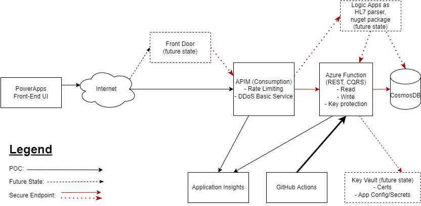

# Team 3

Data to be captured by front-end:

- Submission ID, generated by the system.
- Patient ID, handled as part of a future authentication process. For the proof of concept, it would be okay for the end application to hard code the patient ID.
- Date and time of submission.
- Current health status (one of “I feel well” or “I feel unwell”).
- A list of symptoms over the past 14 days, where each symptom is a free-form text entry with no validation.

## Sample model to be saved in document store:
```json
{
  "id": 1,
  "patientId": 1,
  "submissionDateTime": "2020-04-29T00:00:00.000Z",
  "healthStatus": "I feel unwell",
  "symptoms": [ "stuffy nose", "fever" ]
}
```
## Architecture:

